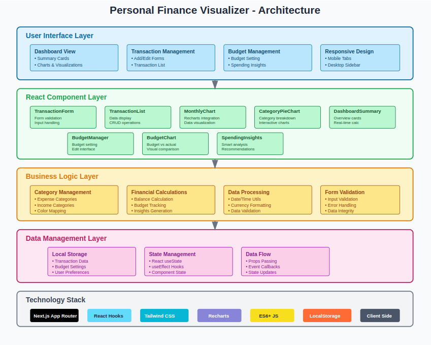

# 💰 Personal Finance Visualizer

A modern, responsive web application built with **Next.js** and **React** that helps users track expenses, manage budgets, and visualize their financial data through interactive charts and insights.

## 📊 Architecture Overview



## 🚀 Features

### Core Functionality
- **Transaction Management**: Add, view, and delete financial transactions with detailed categorization
- **Real-time Calculations**: Automatic calculation of income, expenses, and balance
- **Data Persistence**: Local storage integration for offline data retention
- **Responsive Design**: Optimized for both desktop and mobile devices

### Visualization & Analytics
- **Monthly Expense Charts**: Interactive bar charts showing spending trends over time
- **Category Breakdown**: Pie charts displaying expense distribution by category
- **Budget Comparison**: Visual comparison between budgeted and actual spending
- **Financial Insights**: Smart analysis of spending patterns and budget performance

### Budget Management
- **Category Budgets**: Set monthly spending limits for different expense categories
- **Budget Tracking**: Real-time monitoring of budget utilization with progress indicators
- **Spending Alerts**: Visual warnings for categories approaching or exceeding budget limits
- **Financial Recommendations**: Personalized insights based on spending behavior

## 🛠️ Technology Stack

- **Frontend Framework**: Next.js with App Router (Client Components)
- **UI Library**: React 18 with Hooks (`useState`, `useEffect`)
- **Styling**: Tailwind CSS utility classes
- **Charts**: Recharts library (`BarChart`, `PieChart`, `ResponsiveContainer`)
- **Data Persistence**: Browser LocalStorage API
- **Language**: Modern JavaScript (ES6+)
- **Development**: Hot reload, component-based architecture

## 📁 Project Structure

```
personal-finance-visualizer/
├── .next/                              # Next.js build output (auto-generated)
├── app/                                # Next.js App Router directory
│   ├── components/                     # React components
│   │   ├── TransactionForm.js          # Form with validation, category selection
│   │   ├── TransactionList.js          # Transaction display with delete functionality
│   │   ├── MonthlyExpenseChart.js      # Recharts BarChart for 6-month trends
│   │   ├── CategoryPieChart.js         # Recharts PieChart for category breakdown
│   │   ├── DashboardSummary.js         # Monthly overview with summary cards
│   │   ├── BudgetManager.js            # Budget setting with edit interface
│   │   ├── BudgetComparisonChart.js    # Budget vs actual BarChart comparison
│   │   └── SpendingInsights.js         # Financial insights and recommendations
│   ├── utils/
│   │   └── categories.js               # Category definitions, colors, utilities
│   ├── globals.css                     # Tailwind CSS imports and global styles
│   ├── layout.js                       # Root layout with metadata and font setup
│   ├── page.js                         # Main app component with state management
│   └── favicon.ico                     # App favicon
├── node_modules/                       # Dependencies (auto-installed)
├── public/                             # Static assets served at root
│   ├── file.svg                        # SVG icon/asset file
│   ├── globe.svg                       # Globe icon SVG
│   ├── next.svg                        # Next.js logo SVG
│   ├── vercel.svg                      # Vercel logo SVG
│   └── window.svg                      # Window icon SVG
├── .gitignore                          # Git ignore rules
├── .eslintrc.json                      # ESLint configuration for code quality
├── jsconfig.json                       # JavaScript project configuration
├── next.config.mjs                     # Next.js configuration
├── package-lock.json                   # Exact dependency versions (auto-generated)
├── package.json                        # Project dependencies and scripts
├── postcss.config.mjs                  # PostCSS configuration for Tailwind
├── tailwind.config.js                  # Tailwind CSS configuration
└── README.md                          # Project documentation (this file)
```

## 🎯 Key Components

### Transaction Management
- **TransactionForm**: Form validation, category selection, and real-time input handling
- **TransactionList**: Paginated list with delete functionality and currency formatting

### Data Visualization
- **MonthlyExpenseChart**: Responsive bar chart showing 6-month spending trends
- **CategoryPieChart**: Interactive pie chart with toggle between expense/income views
- **BudgetComparisonChart**: Side-by-side comparison of budgeted vs actual spending

### Budget & Insights
- **BudgetManager**: Intuitive interface for setting category-wise monthly budgets
- **SpendingInsights**: Intelligent analysis providing spending warnings and recommendations

## 💡 Features in Detail

### 📈 Dashboard Overview
- **Financial Summary**: Real-time calculation of income, expenses, and balance
- **Monthly Insights**: Current month spending analysis with budget utilization
- **Visual Indicators**: Color-coded budget status (green/yellow/red)
- **Top Categories**: Identification of highest spending categories

### 📊 Advanced Analytics
- **Trend Analysis**: 6-month historical data visualization
- **Category Distribution**: Percentage breakdown of spending by category
- **Budget Performance**: Visual comparison with percentage utilization
- **Spending Patterns**: Detection of over-budget categories and warnings

### 🎨 User Experience
- **Responsive Design**: Seamless experience across desktop, tablet, and mobile
- **Tab Navigation**: Mobile-optimized navigation with dashboard, history, add, and budget tabs
- **Real-time Updates**: Instant reflection of changes across all components
- **Intuitive Interface**: Clean, modern design with clear visual hierarchy

## 🚀 Getting Started

### Prerequisites
- Node.js (v16 or higher)
- npm or yarn package manager

### Installation

1. **Clone the repository**
   ```bash
   git clone https://github.com/yourusername/personal-finance-visualizer.git
   cd personal-finance-visualizer
   ```

2. **Install dependencies**
   ```bash
   npm install
   # or
   yarn install
   # or
   pnpm install
   ```

3. **Run the development server**
   ```bash
   npm run dev
   # or
   yarn dev
   # or
   pnpm dev
   ```

4. **Open your browser**
   Navigate to [http://localhost:3000](http://localhost:3000)

## 📱 Usage Guide

### Adding Transactions
1. Navigate to the "Add New" tab (mobile) or use the sidebar form (desktop)
2. Fill in transaction details: description, amount, type (income/expense), category
3. Click "Add Transaction" to save

### Setting Budgets
1. Go to the "Budgets" tab or scroll to Budget Manager
2. Click "Edit Budgets" to modify category limits
3. Set monthly budget amounts for each expense category
4. Click "Save Budgets" to apply changes

### Viewing Analytics
1. The Dashboard provides comprehensive overview of your finances
2. Charts automatically update based on your transaction data
3. Budget comparison shows real-time spending vs budgeted amounts
4. Insights section provides personalized financial recommendations

## 🔧 Technical Implementation

### Project Setup & Configuration
- **Next.js App Router**: Modern Next.js architecture with `app/` directory structure
- **ESLint**: Code quality enforcement with `.eslintrc.json` configuration
- **Tailwind CSS**: Utility-first styling with `tailwind.config.js` customization
- **PostCSS**: CSS processing pipeline configured in `postcss.config.mjs`
- **TypeScript Support**: JavaScript project with `jsconfig.json` for IDE enhancements

### State Management
- **React Hooks**: `useState` for component state management (transactions, budgets, form data)
- **useEffect**: For side effects like localStorage persistence and data loading
- **Local Storage**: Persistent data storage using `localStorage.getItem()` and `localStorage.setItem()`
- **Real-time Updates**: Automatic recalculation and chart updates when data changes

### Data Processing
- **Transaction Filtering**: Dynamic filtering by date, type, and category using JavaScript array methods
- **Budget Calculations**: Real-time budget utilization and remaining amounts calculation
- **Currency Formatting**: Indian Rupee (INR) formatting using `Intl.NumberFormat('en-IN')`
- **Date Handling**: JavaScript Date object for month/year filtering and sorting

### Component Architecture
- **Client Components**: All components use `'use client'` directive for interactivity
- **Prop Drilling**: Data passed down through props (`transactions`, `budgets`, `onAdd`, `onDelete`)
- **Event Handling**: Form submissions, button clicks, and user interactions
- **Conditional Rendering**: Dynamic UI based on data availability and user state

### Responsive Design
- **Mobile-First**: Tab-based navigation for small screens using CSS Grid
- **Desktop Layout**: Sidebar and grid-based layout for larger screens
- **Tailwind CSS**: Utility-first CSS framework with responsive breakpoints (`md:`, `lg:`)
- **Responsive Charts**: Using `ResponsiveContainer` from Recharts for adaptive chart sizing

### Build & Deployment
- **Next.js Build**: Optimized production builds in `.next/` directory
- **Static Generation**: Pre-built pages for optimal performance
- **Development Server**: Hot reload with file watching for rapid development
- **Code Splitting**: Automatic code splitting for faster page loads

## 🎨 Design Philosophy

### User-Centric Approach
- **Simplicity**: Clean, intuitive interface focusing on essential features
- **Visual Feedback**: Immediate response to user actions with loading states
- **Progressive Disclosure**: Advanced features accessible without overwhelming new users

### Data Visualization
- **Color Psychology**: Strategic use of colors (green for income, red for expenses)
- **Interactive Charts**: Hover effects and tooltips for detailed information
- **Contextual Information**: Charts include relevant metadata and formatting

---

## Project Link: [https://github.com/vandanaj0110/personal-finance-visualizer-git](https://github.com/vandanaj0110/personal-finance-visualizer-git)
